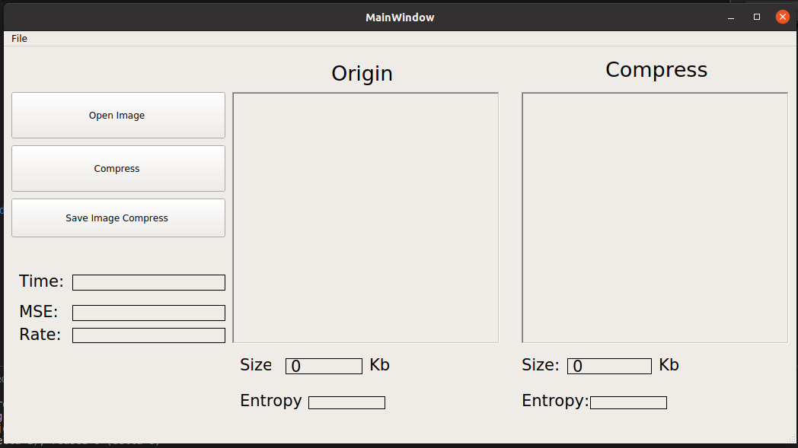

# Image Compressor

## 1. Overview

This project implements a basic graphical interface that simulates an image compression system based on the JPEG standard using **Python, OpenCV, and PyQt5**.

## 2. Flow Diagram

### 2.1 Encoding Process

### 2.2 Decoding Process

---

## 3. System Description

### 3.1 Encoding

The encoding process consists of the following steps:

- The input image is divided into small **8×8 blocks** to reduce computational complexity.
- Since the image dimensions may not be divisible by 8, **zero-padding** is applied to ensure complete 8×8 blocks.
- Each 8×8 block is transformed using the **Discrete Cosine Transform (DCT)**.
- The transformed blocks are combined to obtain the DCT-transformed image.
- **Quantization** is performed using a quantization table and the **zigzag scanning algorithm**.
- The resulting matrices are converted into **one-dimensional arrays**.
- Data compression is applied using **Run-Length Encoding (RLE)** or **Huffman coding**.

### 3.2 Decoding

The decoding process includes the following steps:

- The compressed data is decoded to reconstruct the quantized coefficients.
- Inverse zigzag scanning is applied to restore the 8×8 block structure.
- **Dequantization** is performed using the quantization table.
- Each block undergoes **Inverse DCT (IDCT)**.
- The blocks are merged to reconstruct the original image.
- Padding pixels are removed to recover the original image size.

---

## 4. Graphical User Interface

Some screenshots of the implemented graphical interface are shown below:

### Figure 1: Main Interface

### Figure 2: Compression Interface

